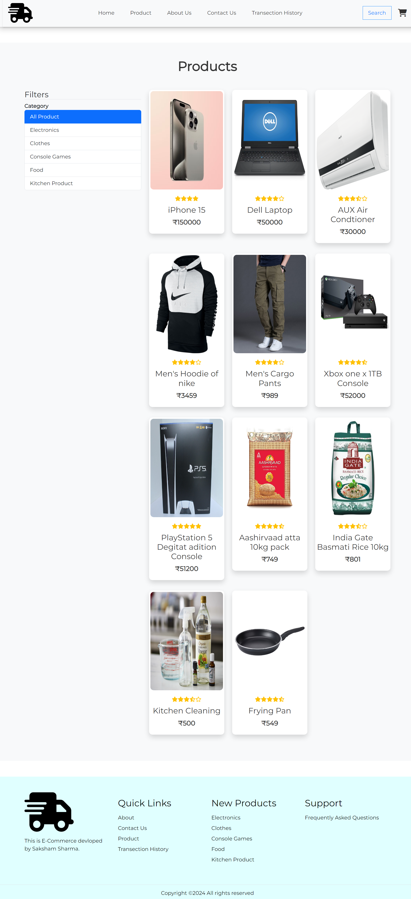
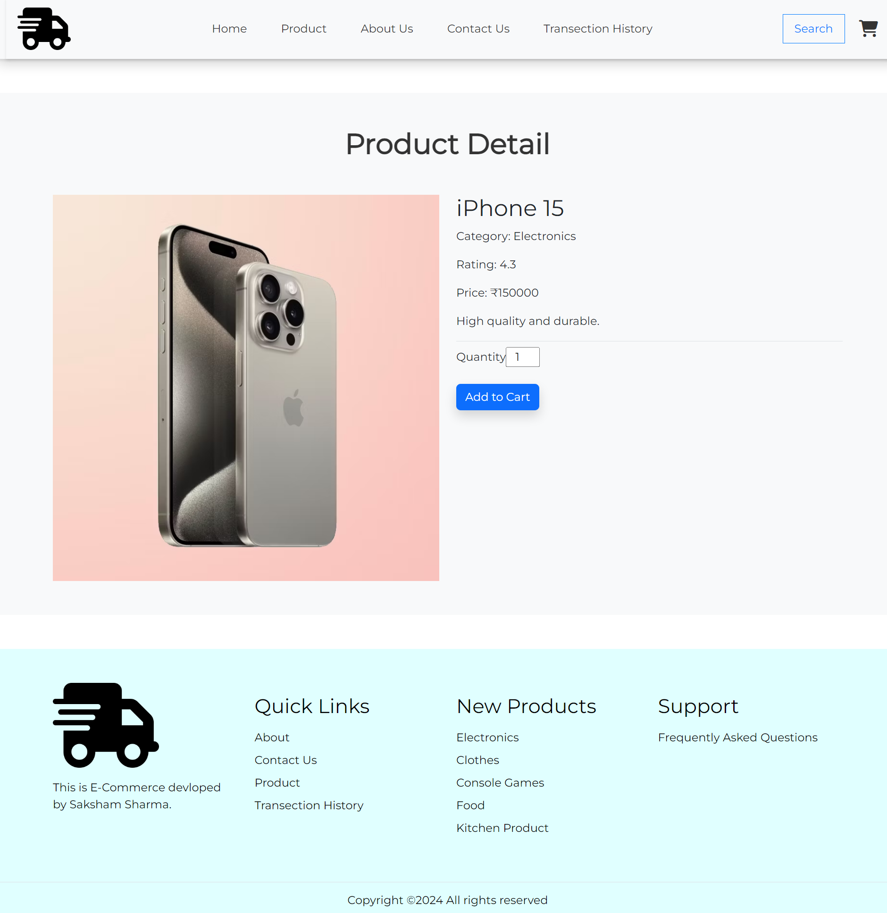
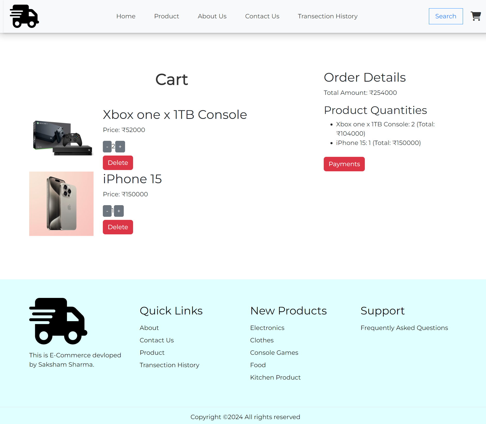
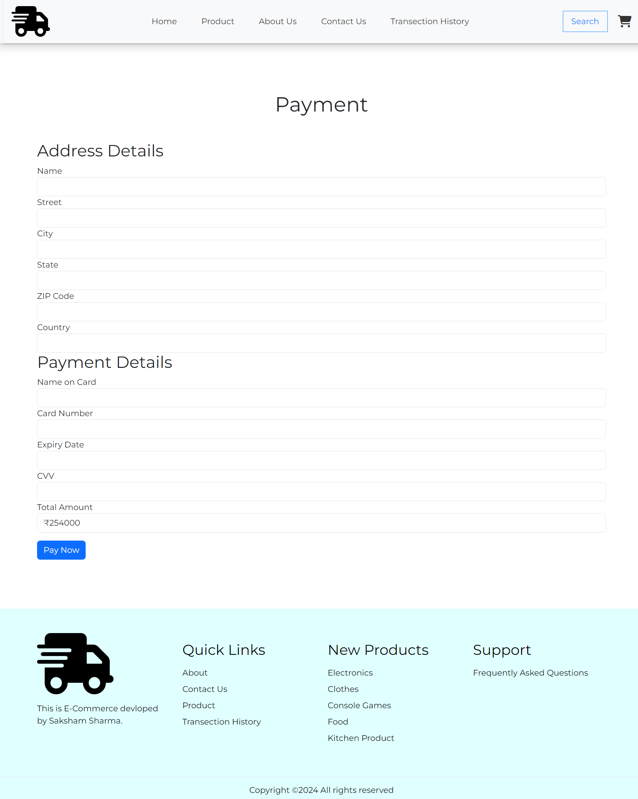
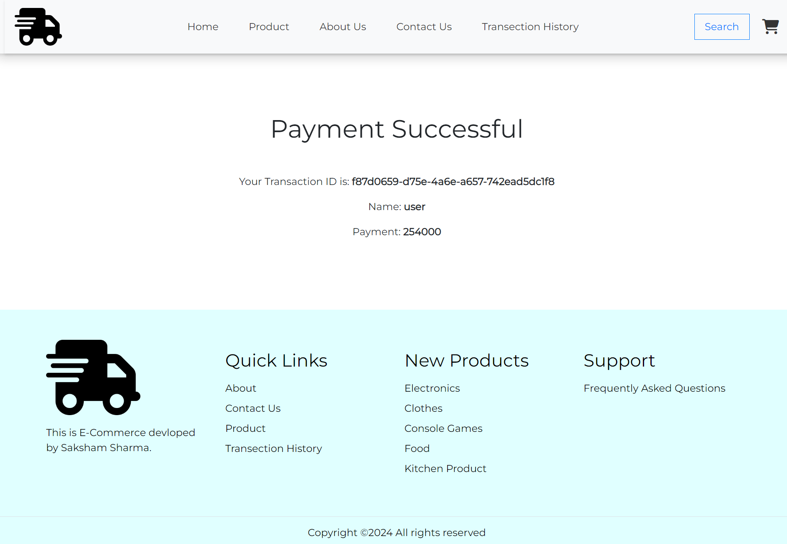
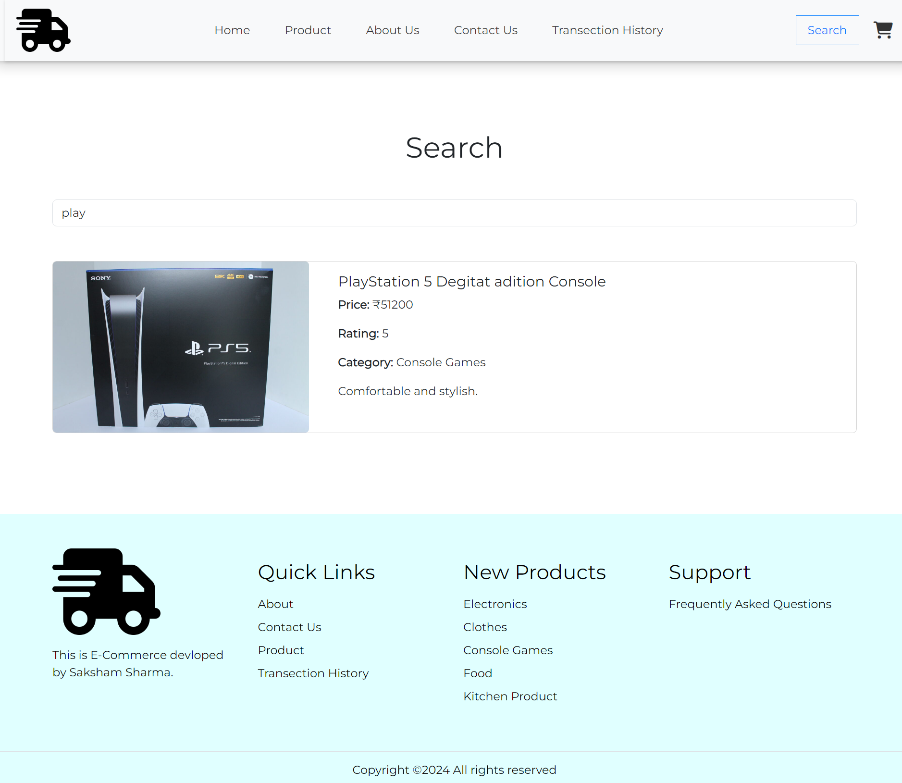

# React-Ecommerce-Website
This project is a simple e-commerce website built using React. It includes various pages such as Home, Product, Product Detail, Cart, Payment, Successful Payment, Search, Category Products, Transaction History, Contact, About, and FAQ.

## Features
1. Home page with carousel and latest products
2. Product page with filter by category
3. Product detail page with product information and add to cart functionality
4. Cart page with quantity control and total amount calculation
5. Payment page with form validation and transaction history storage
6. Successful payment page with transaction details
7. Search page with search functionality and search results display
8. Category products page with products filtered by category
9. Transaction history page with all previous transactions
10. Contact page with contact form
11. About page with information about the company
12. FAQ page with frequently asked questions

## Technologies Used
1. React
2. React Router DOM
3. Bootstrap
4. Font Awesome
5. Card Validator
6. UUID

## Getting Started
To get started with this project, follow these steps:
1. Clone the repository: git clone https://github.com/Saksham052003/React-Ecommerce-Website.git
2. Install dependencies: npm install
3. Start the development server: npm start
4. Open your browser and navigate to http://localhost:3000

Note: This project uses a sample JSON data file for product data. You can replace it with your own data source or API.

## Screenshots

### Home Page

### Product Page

### Product Detail Page

### Cart Page

### Payment Page

### Successful Payment Page

### Search Page

